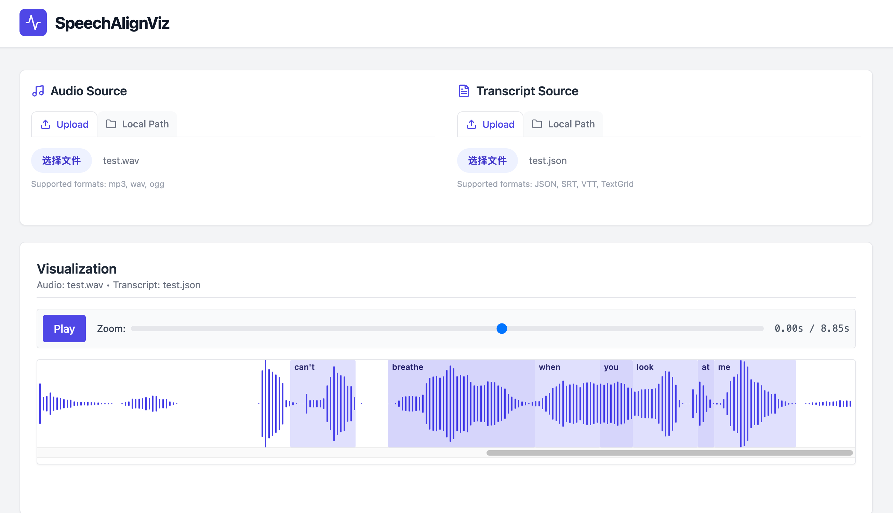

# SpeechAlignViz 🎙️📝

**SpeechAlignViz** is a web-based visualization tool for audio-text alignment. (🤗 [Hugging Face](https://huggingface.co/spaces/LoganLiu66/SpeechAlignViz)) It allows researchers and developers to verify and interact with speech transcription segments (SRT, VTT, TextGrid, JSON) directly on the audio waveform.

<p align="center">
  
</p>

## Features

- **Unified Waveform View**: View text segments directly on the audio timeline.
- **Multi-Format Support**:
  - **JSON**: custom format `[{text, start_time, end_time}]`
  - **SRT**: SubRip Subtitle files
  - **WebVTT**: Web Video Text Tracks
  - **TextGrid**: Praat annotation files
- **Interactive Control**:
  - Click any segment to play its corresponding audio.
  - Zoom in/out for precise alignment checks.
  - Automatic audio-text synchronization.
- **Local & Upload Support**: Load files from your local filesystem or upload them directly via the browser.

<p align="center">
  
</p>

## Installation

### From PyPI (Coming soon!)
```bash
pip install speech-align-viz
```

### From Source
```bash
git clone https://github.com/LoganLiu66/SpeechAlignViz.git
cd SpeechAlignViz
pip install -e .
```

## Usage

Start the server using the CLI:
```bash
speech-align-viz serve --port 8001 --host 0.0.0.0
```
Then open [http://0.0.0.0:8001](http://0.0.0.0:8001) in your browser.

### CLI Figure Export
You can generate a static alignment figure directly from the command line:

```bash
speech-align-viz export \
  --audio ./examples/example.wav \
  --subtitle ./examples/example.json \
  --output-fig ./examples/example.png
```
*Note: The figure width is automatically calculated based on audio length to prevent overcrowding, but you can override it with `--width N`.*

### Loading Data
1. **Audio**: Upload an audio file (mp3, wav, ogg) or provide a local path.
2. **Transcript**: Upload a support transcript file (.json, .srt, .vtt, .TextGrid) or provide a local path.

## Development

The project structure is split into:
- `src/speech_align_viz`: FastAPI backend and CLI.
- `frontend`: React + Vite + WaveSurfer.js frontend.

To build the frontend:
```bash
cd frontend
npm run build
```
This will bundle the frontend into `src/speech_align_viz/static`.

## License
MIT
